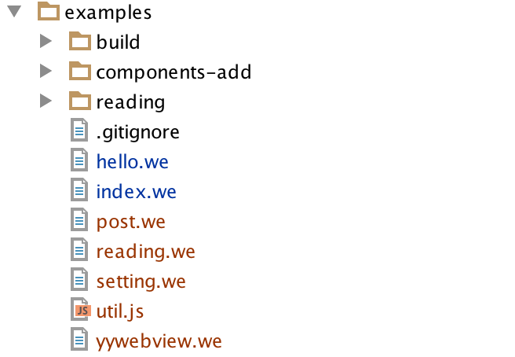
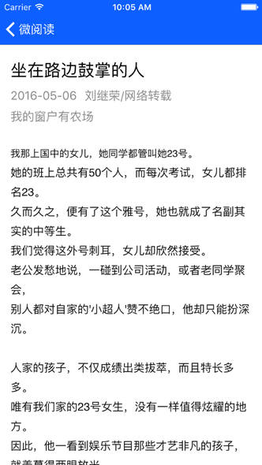

## 微阅读
基于weex开发的微阅读App，供准备学习Weex的同学大家参考。内容包括：页面跳转、tabbar、navpage抽离出来自己定制等。           

## 如何运行     
1. 下载https://github.com/alibaba/weex官方仓库。      
2. 删除examples目录下面的所有文件，将该项目里面所有文件拷贝进去。         
	
3. Web预览。在weex仓库根目录执行

	```
	./start
	```
	这时候应该启动了编译和服务器。     
	浏览器输入：127.0.0.1:12580 即可预览效果。     
4. iOS预览，按照weex仓库步骤，运行playground。  

## 效果  
      
       
     
      
       